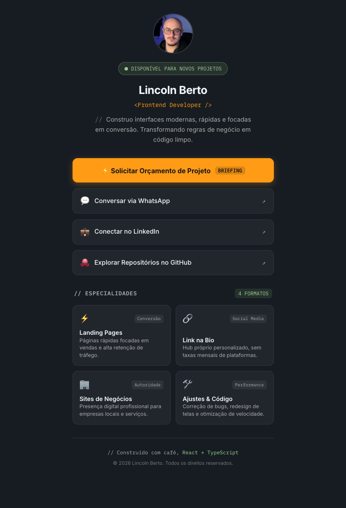

# 🔗 LINCOLN BERTO - DEV BIO HUB

> [!NOTE]
> **Projeto de Portfólio:** Este repositório foi desenvolvido para substituir plataformas prontas de agregação de links por uma solução própria de alta performance. O código foi projetado com foco em arquitetura modular em React com TypeScript, acessibilidade nativa com a API `<dialog>`, design tokens no CSS e automação de orçamentos para captação de clientes freelance.

Hub interativo e canal de conversão digital desenvolvido para centralizar serviços freelance, projetos em destaque e canais de contato de **Lincoln Berto**. O projeto entrega carregamento instantâneo, visual técnico refinado no estilo dark mode com micro-interações fluidas e um fluxo de briefing que despacha dados formatados diretamente para o WhatsApp sem intermediação de backend.

---

## 📱 Demonstração do Projeto

  <table>
    <tr>
      <td align="center" width="60%">
        <b>📱 Versão Mobile</b>  
        
      </td>   
  </table>

---

## 🚀 Stack Tecnológica e Conceitos Aplicados

O projeto foi construído utilizando o ecossistema moderno do React, priorizando código limpo, controle estrito de tipos e ausência de dependências desnecessárias:

- **React & TypeScript:** Componentização funcional tipada, garantindo contratos estritos para propriedades e integridade nos estados controlados de formulário (`BudgetFormData`).
- **Vite:** Motor de build ultraveloz baseado em ESM (_ECMAScript Modules_) nativo com compilação via esbuild, proporcionando HMR instantâneo.
- **CSS Modules:** Encapsulamento de estilos por componente com hashing de classes em tempo de compilação, eliminando vazamento de escopo global.
- **Design Tokens Globais:** Padronização da paleta técnica (`#161b22`, `#ff9b15`, `#9bcc8f`), escalas tipográficas (`Inter` e `IBM Plex Mono`) e variáveis estruturais via `:root`.
- **HTML5 Acessível & `<dialog>` Nativo:** Implementação de modal operando na Top Layer do navegador através de `.showModal()`, aprisionamento de foco (_focus trap_), fechamento nativo com a tecla `Esc` e atributos semânticos (`aria-live`, `aria-labelledby`).
- **Navegação DOM Dinâmica:** Disparo de deep link via elemento `<a>` virtual temporário com acionamento nativo via `.click()`, eliminando o _double URI encoding_ de navegadores móveis e preservando emojis e quebras de linha no WhatsApp.

---

## 📝 Funcionalidades em Destaque

- **Badge de Status com Animação Nativa:** Indicador de disponibilidade para novos projetos com efeito de radar pulsante em CSS puro (`@keyframes ping`).
- **Grid de Especialidades:** Vitrine responsiva construída em CSS Grid (`1fr 1fr`) estruturada com tags semânticas `<article>` detalhando Landing Pages, Links na Bio, Sites Institucionais e Manutenções.
- **Modal de Briefing Acessível:** Janela suspensa nativa que escurece o fundo com `backdrop-filter: blur`, sem sobrecarga de classes manuais de `z-index`.
- **Formulário de Orçamento Controlado:** Interface com radio buttons customizados (`type="button"`), validação de campos essenciais e prevenção de submissão incorreta.
- **Automação de Ticket para WhatsApp:** Geração automática de mensagem no formato de recibo/ticket pronta para envio, otimizando o tempo de resposta comercial.

---

## 👨‍💻 Autor

Desenvolvido por **Lincoln Berto**.

- **LinkedIn:** [https://www.linkedin.com/in/lincoln-berto/](https://www.linkedin.com/in/lincoln-berto/)
- **GitHub:** [https://github.com/eilincoln](https://github.com/eilincoln)
- **Portfólio:** [https://lincolnberto.com.br](https://lincolnberto.com.br)
